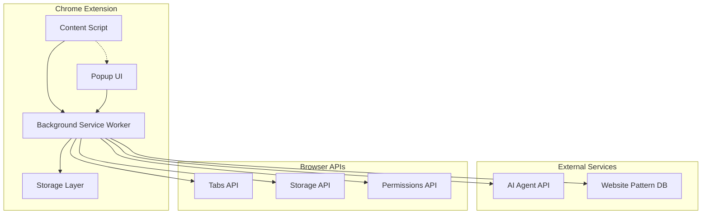

# Design Document

## Overview

The Agentic Chrome Extension is a browser extension that provides intelligent, context-aware AI assistance by analyzing the current website and offering tailored suggestions. The extension combines website pattern recognition, custom task management, AI agent integration, and automated web interactions to create a personalized AI-powered browsing experience.

## Architecture

### High-Level Architecture



### Component Responsibilities

- **Content Script**: Analyzes page content, executes DOM manipulations, handles automated tasks
- **Popup UI**: Displays suggestions, manages user interactions, shows task results
- **Background Service Worker**: Orchestrates AI requests, manages storage, handles cross-tab communication
- **Storage Layer**: Manages custom tasks, website patterns, user preferences, and cache

## Components and Interfaces

### 1. Website Pattern Recognition Engine

**Purpose**: Identifies website types and matches them to appropriate suggestion categories.

**Interface**:
```typescript
interface PatternEngine {
  analyzeWebsite(url: string, content: PageContent): WebsiteContext
  getMatchingPatterns(context: WebsiteContext): Pattern[]
  registerCustomPattern(pattern: CustomPattern): void
}

interface WebsiteContext {
  domain: string
  category: WebsiteCategory
  pageType: PageType
  extractedData: Record<string, any>
}

enum WebsiteCategory {
  SOCIAL_MEDIA = 'social_media',
  ECOMMERCE = 'ecommerce',
  PROFESSIONAL = 'professional',
  NEWS_CONTENT = 'news_content',
  PRODUCTIVITY = 'productivity',
  CUSTOM = 'custom'
}
```

### 2. Task Management System

**Purpose**: Handles creation, storage, and execution of custom reusable tasks.

**Interface**:
```typescript
interface TaskManager {
  createTask(task: CustomTask): Promise<string>
  updateTask(taskId: string, updates: Partial<CustomTask>): Promise<void>
  deleteTask(taskId: string): Promise<void>
  getTasksForWebsite(context: WebsiteContext): Promise<CustomTask[]>
  executeTask(taskId: string, context: ExecutionContext): Promise<TaskResult>
}

interface CustomTask {
  id: string
  name: string
  description: string
  websitePatterns: string[]
  promptTemplate: string
  outputFormat: OutputFormat
  automationSteps?: AutomationStep[]
  createdAt: Date
  usageCount: number
}

interface ExecutionContext {
  websiteContext: WebsiteContext
  pageContent: PageContent
  userInput?: Record<string, any>
}
```

### 3. AI Agent Integration

**Purpose**: Communicates with external AI services to process user requests.

**Interface**:
```typescript
interface AIAgentService {
  processRequest(request: AIRequest): Promise<AIResponse>
  validateResponse(response: AIResponse): boolean
  handleError(error: AIError): ErrorResponse
}

interface AIRequest {
  prompt: string
  context: WebsiteContext
  taskType: TaskType
  outputFormat: OutputFormat
  constraints: SecurityConstraints
}

interface AIResponse {
  content: string
  format: OutputFormat
  confidence: number
  suggestions?: string[]
  automationInstructions?: AutomationStep[]
}
```

### 4. Automation Engine

**Purpose**: Executes automated tasks on web pages through DOM manipulation.

**Interface**:
```typescript
interface AutomationEngine {
  executeSteps(steps: AutomationStep[], context: PageContext): Promise<AutomationResult>
  validatePermissions(steps: AutomationStep[]): Promise<boolean>
  simulateUserAction(action: UserAction): Promise<void>
}

interface AutomationStep {
  type: 'click' | 'type' | 'select' | 'wait' | 'extract'
  selector: string
  value?: string
  waitCondition?: WaitCondition
}

interface AutomationResult {
  success: boolean
  completedSteps: number
  extractedData?: Record<string, any>
  error?: string
}
```

### 5. Security and Privacy Manager

**Purpose**: Ensures secure handling of sensitive data and user privacy.

**Interface**:
```typescript
interface SecurityManager {
  sanitizePageContent(content: PageContent): SafePageContent
  validateWebsitePermissions(domain: string): SecurityLevel
  encryptSensitiveData(data: any): EncryptedData
  checkDataSharingConsent(dataType: DataType): boolean
}

enum SecurityLevel {
  PUBLIC = 'public',
  CAUTIOUS = 'cautious',
  RESTRICTED = 'restricted'
}
```

## Data Models

### Core Data Structures

```typescript
interface PageContent {
  url: string
  title: string
  headings: string[]
  textContent: string
  forms: FormElement[]
  links: LinkElement[]
  metadata: Record<string, string>
}

interface Suggestion {
  id: string
  title: string
  description: string
  category: string
  taskId?: string
  isCustom: boolean
  estimatedTime: number
  requiresPermission: boolean
}

interface TaskResult {
  success: boolean
  content?: string
  format: OutputFormat
  automationSummary?: string
  error?: string
  timestamp: Date
}

interface UserPreferences {
  enabledCategories: WebsiteCategory[]
  customPatterns: CustomPattern[]
  privacySettings: PrivacySettings
  automationPermissions: Record<string, boolean>
}
```

### Storage Schema

```typescript
interface StorageSchema {
  // User-created custom tasks
  customTasks: Record<string, CustomTask>
  
  // Website-specific patterns and configurations
  websitePatterns: Record<string, WebsitePattern>
  
  // User preferences and settings
  userPreferences: UserPreferences
  
  // Cache for AI responses and website analysis
  responseCache: Record<string, CachedResponse>
  
  // Usage analytics for optimization
  usageStats: Record<string, UsageMetrics>
}
```

## Error Handling

### Error Categories

1. **Network Errors**: AI service unavailable, timeout, rate limiting
2. **Permission Errors**: Insufficient permissions for automation, blocked by CSP
3. **Content Errors**: Unable to analyze page, malformed content
4. **User Errors**: Invalid task configuration, missing required fields
5. **Security Errors**: Blocked sensitive data access, privacy violations

### Error Recovery Strategies

```typescript
interface ErrorHandler {
  handleNetworkError(error: NetworkError): Promise<FallbackResponse>
  handlePermissionError(error: PermissionError): Promise<UserPrompt>
  handleContentError(error: ContentError): Promise<GenericSuggestions>
  logError(error: Error, context: ErrorContext): void
}
```

## Testing Strategy

### Unit Testing
- Test individual components in isolation
- Mock external dependencies (AI services, Chrome APIs)
- Validate data transformations and business logic
- Test error handling and edge cases

### Integration Testing
- Test component interactions within the extension
- Validate Chrome API integrations
- Test AI service communication
- Verify storage operations

### End-to-End Testing
- Test complete user workflows across different websites
- Validate suggestion accuracy and relevance
- Test automation execution on real web pages
- Verify privacy and security measures

### Performance Testing
- Measure extension impact on page load times
- Test response times for AI requests
- Validate memory usage and cleanup
- Test with large numbers of custom tasks

### Security Testing
- Validate content sanitization
- Test permission boundaries
- Verify encrypted storage
- Test against XSS and injection attacks

### Browser Compatibility Testing
- Test across different Chrome versions
- Validate manifest v3 compliance
- Test on different operating systems
- Verify accessibility compliance

## MCP Integration Architecture

### Model Context Protocol Implementation

The extension will implement MCP (Model Context Protocol) patterns for structured context management:

```typescript
interface MCPContext {
  resources: MCPResource[]
  tools: MCPTool[]
  prompts: MCPPrompt[]
  metadata: MCPMetadata
}

interface MCPResource {
  uri: string
  name: string
  description?: string
  mimeType?: string
  content: string | ArrayBuffer
}

interface MCPTool {
  name: string
  description: string
  inputSchema: JSONSchema
  handler: (args: any) => Promise<any>
}
```

### Enhanced Prompt Management System

**Purpose**: Properly handle custom task prompt templates and provide advanced templating capabilities.

**Interface**:
```typescript
interface PromptManager {
  processCustomTaskPrompt(task: CustomTask, context: ExecutionContext): Promise<string>
  injectTemplateVariables(template: string, context: TemplateContext): string
  validatePromptTemplate(template: string): ValidationResult
  debugPromptExecution(taskId: string, finalPrompt: string): void
}

interface TemplateContext {
  domain: string
  pageTitle: string
  selectedText?: string
  extractedContent: CleanTextContent
  userInput?: Record<string, any>
}
```

### Intelligent Text Extraction Engine

**Purpose**: Extract clean, structured content from web pages instead of raw HTML.

**Interface**:
```typescript
interface TextExtractionEngine {
  extractCleanContent(document: Document): CleanTextContent
  extractSelectedContent(selection: Selection): CleanTextContent
  identifyMainContent(document: Document): Element[]
  removeNoiseElements(content: string): string
}

interface CleanTextContent {
  mainText: string
  headings: TextBlock[]
  paragraphs: TextBlock[]
  lists: ListBlock[]
  metadata: ContentMetadata
}

interface TextBlock {
  content: string
  level?: number
  context: string
}
```

## Implementation Considerations

### Chrome Extension Architecture
- Use Manifest V3 for modern Chrome extension standards
- Implement service worker for background processing
- Use content scripts for page interaction
- Leverage Chrome's storage and permissions APIs

### MCP Integration Strategy
- Implement MCP-compliant context structures
- Support MCP server connections for external tools
- Use structured resource and tool patterns
- Maintain compatibility with existing AI services

### Enhanced Prompt Processing
- Fix custom task prompt template usage in AI requests
- Implement template variable injection system
- Add prompt validation and debugging capabilities
- Ensure custom prompts override generic system prompts

### Intelligent Content Extraction
- Replace simple HTML text extraction with semantic parsing
- Implement main content area detection algorithms
- Add support for dynamic content and shadow DOM
- Provide clean, structured text for AI processing

### AI Integration Strategy
- Support multiple AI providers (OpenAI, Claude, local models)
- Implement request queuing and rate limiting
- Cache responses for performance
- Handle API key management securely

### Performance Optimization
- Lazy load suggestion categories
- Implement intelligent caching strategies
- Minimize content script injection overhead
- Use efficient DOM querying techniques

### Privacy and Security
- Implement content sanitization before AI requests
- Use Chrome's secure storage APIs
- Provide clear privacy controls
- Implement consent management for data sharing